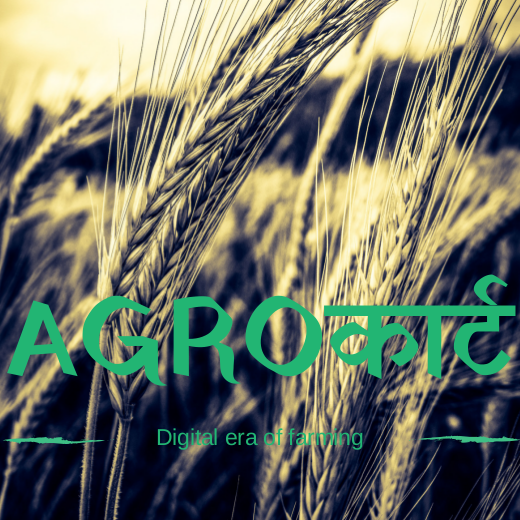

# Agrocartt

It is regarding supply chain management for the post harvest losses of crop products in India. We are creating a decentralized blockchain powered hyperledger project for solving this issue. We are open to suggestions and ideas that can help us so that we can grow as emerging tech company and we are creating a new digital era for farmers. This repository is under Paytm build for India Initiative. We want to create decentralized application for Farmers and customers. It is a Pan India Project. Developers who have experience in Blockchain,Solidity Programming and Mobile devlelopment are most welcome. Last but not least, those who have knowledge about agriculture and business are also inivited to join.

[Contributing Guidlines](CONTRIBUTING.md)

   
   

      
    Logo By Anurag One of the contributor
    

# For Contributing to Android Project

1. Clone the Repository
2. From android studio select Open Project -> (Path To) AgroCartt App
3. It will automatically compile and run.

[Android App Details and ChangeLogs](AgroCarttApp/CHANGELOG.md)

**Note(To the developers working on Android Project)**:- _It is requested that all the changes made should be logged in the [CHANGELOG.md](AgroCarttApp/CHANGELOG.md), this helps fellow developers to know the state of the project. If possible provide comments in the code especially when importing an external library or defining a method that the developer thinks is difficult to understand. 
Regards, **The AgroCartt Team**_

Current State of the app:-

 

      
    

* For initiating a bug report please read [Bug Report Template](https://github.com/PaytmBuildForIndia/Agrocartt/blob/master/.github/ISSUE_TEMPLATE/bug_report.md)
* For initiating a Feature Request Please read [Feature Request Template](https://github.com/PaytmBuildForIndia/Agrocartt/blob/master/.github/ISSUE_TEMPLATE/feature_request.md)
